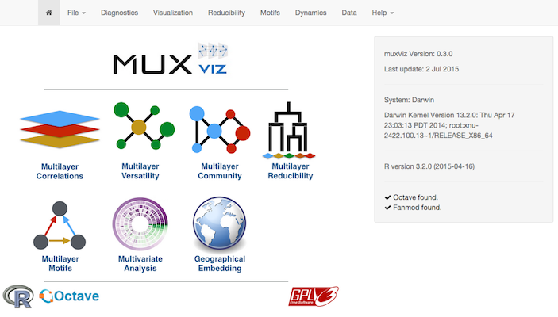
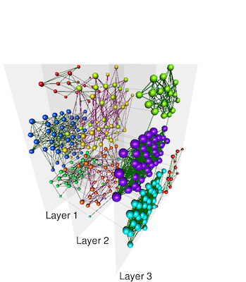
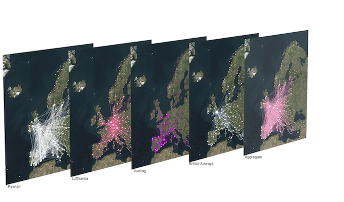
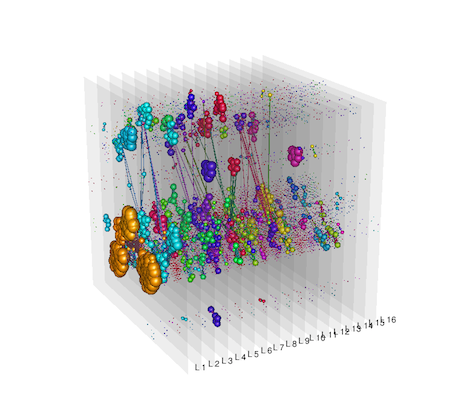
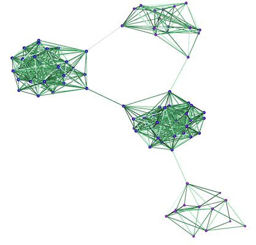
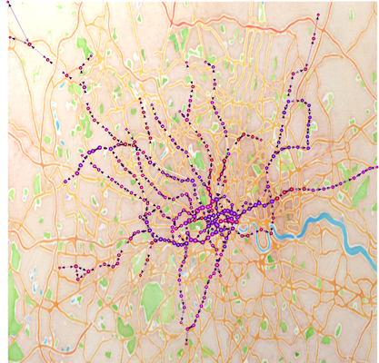

muxViz v0.3
=========

### Visualization and Analysis of Multilayer Networks

muxViz is a platform for the visualization and the analysis of interconnected multilayer networks. The current implementation exploits a Graphical User Interface (working with any browser) to provide access to many customizable graphic options to render networks. The great novelty of this version is the support for the analysis of multiplex data:

- Multilayer correlation analysis
- Multilayer centrality analysis and annular representation
- Multilayer community structure detection
- Multilayer structural reducibility
- Multilayer motifs analysis
- Animated visualization of dynamical processes and time-varying multilayer networks

Support for data analysis is not mandatory and requires a working installation of GNU Octave 3.4.0 or above. 

#### Official Websites and Social Networks

Please, visit the official website (<http://muxviz.net>) of muxViz for further information. 

You might also want to take a look at muxViz in action: see the [Youtube channel](https://www.youtube.com/channel/UCinHX7m-8_EFFJo2A8huoUA)

Visit the dedicated [Google Group](https://groups.google.com/forum/#!forum/muxviz) if you have questions or to report bugs.

Instead, if you create amazing visualizations using muxViz and you want to tweet them, remember to include the "#muxviz" hashtag: we will be happy to retweet.

#### Citation

If you use muxViz (or any part of muxViz, or images available in the gallery) for your multilayer analysis and visualization, you should cite the paper

Manlio De Domenico, Mason A. Porter, Alex Arenas, Multilayer Analysis and Visualization of Networks, published in [Journal of Complex Networks](http://comnet.oxfordjournals.org/content/early/2014/10/12/comnet.cnu038.abstract) (Open Access)

Please, note that muxViz is based on some algorithms developed in other studies. You should cite the original paper(s) every time that you use those algorithms. 

#### The Graphical User Interface

Note that linked data is in a different format and can not be used "as they are" by muxViz. A tool for easily convert from that format to muxViz is under development. 

##### Requirements and Installation

Download and install a copy of Octave (3.4.0 or above):

<http://www.gnu.org/software/octave/download.html>

Octave should be accessible through command line from any folder (i.e., it is mandatory to add it in your PATH environment variable). If you are not familiar with this simple task, you should visit <http://www.java.com/en/download/help/path.xml>

muxViz requires R v3.2.0 (or above). Download and install a copy of R from

<http://www.r-project.org/>

Some external packages are required within the R environment. However, the main script should be able to detect the missing packages and install them, automatically. Therefore, it is likely that you *do not* need to install them by yourself.

You can download muxViz from Github: <https://github.com/manlius/muxViz/archive/master.zip>

To work properly with geographical networks, the GDAL (Geospatial Data Abstraction Library) is required and should be installed *before* running muxViz for the first time. GDAL should be available as an R package and should be easily installed just by typing

	install.packages("sp")
	install.packages("rgdal")

within the R environment. However, in a few cases it can be more complicated and some users reported problems for its installation. If this is also your case you might want to take a look at some suggestions on stackoverflow (<http://stackoverflow.com/questions/15248815/rgdal-package-installation>) or on spatial.ly (<http://spatial.ly/2010/11/installing-rgdal-on-mac-os-x/>). In any case, it is highly recommend to visit the GDAL website and follow the hints provided there (<http://trac.osgeo.org/gdal/wiki/BuildHints>).

###### Very quick installation on Linux

If you use a Linux (Ubuntu-like) distribution, you are very lucky, because the following BASH script will do the job for you:

    #download Octave and R from their repository
    wget http://ftp.gnu.org/gnu/octave/octave-3.6.0.tar.gz
    wget http://cran.es.r-project.org/src/base/R-3/R-3.2.0.tar.gz
    DIR=$PWD
    
    #install Octave
    sudo apt-get build-dep octave
    sudo mv octave-3.6.0.tar.gz ~
    cd ~
    tar xvf octave-3.6.0.tar.gz
    cd octave-3.6.0
    ./configure
    make
    sudo make install
    cd $DIR
    
    #install R
    sudo apt-get build-dep r-base-core
    sudo mv R-3.0.3.tar.gz ~
    cd ~
    tar xvf R-3.0.3.tar.gz
    cd R-3.0.3
    ./configure
    make
    sudo make install
    
    #install GDAL
    sudo apt-get install libgdal1-dev libproj-dev

Finally, if your system has a working installation of Octave, R and GDAL, you can download the last version of muxViz, unzip it, go into the unzipped folder and type the following within R environment:

	source('muxVizGUI.R')

This should be enough. The script will check for the required packages and will try to automatically install the missing ones. The whole process might take a few minutes, the first time you run muxViz.

##### Troubleshooting

Please, if you have any problem during the installation of muxViz, visit the dedicated [Google Group](https://groups.google.com/forum/#!forum/muxviz) or check the TROUBLESHOOTING.md file before asking for help: you might find the solution faster.

If you find a smart solution to an installation/usage issue, feel free to send me an email and I will add your solution to the TROUBLESHOOTING.md file.

### Gallery

Here there are a few multilayer networks rendered by muxViz.
	

Please, also note that after a proper set up it is possible to use muxVizGUI also for the visualization (and basic analysis) of single-layer networks (equivalent to old monoxViz 0.1).

")

### Usage

##### Format of an input file

The configuration file is a ASCII file including the list of layers to be included in a multiplex, the corresponding labels and the possible layout file to define node properties (e.g., ID, labels, geographic coordinates, etc).

Format of a configuration file:

	path_layer_X;label_layer_X;layout_layer_X

where 

- path_layer_X: [mandatory] specify the path and the filename to the edges list to be used as layer
- label_layer_X: [optional] specify the label to be used in the rendering for that layer
- layout_layer_X: [optional] specify the path and the filename to the file containing information about nodes

A typical edges list is expected to be a file with at most three columns, giving the list of edges from a node (first column) to other nodes (second column), possibly weighted by an integer or floating number (third column). For instance:

	1 2 0.5
	1 3 1.4
	...
	18 124 0.1

is a typical weighted edges list.

IDs of nodes are expected to be sequential integers (starting from 0 or 1, up to the number of nodes in the network). Nevertheless, it is possible to import label-based edges list, where the IDs of nodes are labels (arbitrary integers or strings): in this case, one should check the appropriate box before importing the networks, to let muxViz know how to interpret the format. The edges list could look like

	alice bob 0.5
	alice charlie 1.4
	...
	john david 0.1

In this specific case, it is mandatory to provide a layout file (see next section) reporting the sequential node ID (field nodeID) to be assigned to each node label (field nodeLabel). This would look like

	nodeID nodeLabel
	1 alice
	2 bob
	3 john
	4 david
	...
    
##### Format of a layout file

The first line of the file must specify the name of the correponding node attributes. Allowed attributes:

- nodeID:      [mandatory] numerical integer id to identify each node
- nodeLabel: [optional] string specifying the label attribute
- nodeX:       [optional] float value specifying the Cartesian coordinate x for the layout
- nodeY:       [optional] float value specifying the Cartesian coordinate x for the layout
- nodeLat:    [optional] float value specifying the latitude for the geographic layout
- nodeLong: [optional] float value specifying the longitude for the geographic layout

The order of the columns should not be relevant.
If nodeLat and nodeLong are specified, they will be automatically converted to Cartesian coordinates (through Mercator projection).

The properties of each node in the multilayer must be specified or default values will be used (i.e., automatic labeling and layouting). If the number of nodes in the network is different from the number of nodes provided in the layout file, it will be assumed that something is wrong with the layout file and default values will be used.

##### Format of a timeline file

This module allows to build nice animated visualizations corresponding to dynamical processes on the top of a multilayer network. For instance, one can visualize the movements of one (or more) random walker(s) in the network, or the spreading of an epidemics or of a meme in a social network, the traffic (and possible congestions) in a transport/communication network, etc.

The idea is to feed the module with a 'timeline' file where the change of the state of nodes and edges in the multilayer network are specified at each time step. The 'state' of an object can be altered by changing its color and/or its size. For instance, in the case of an epidemics spreading in a country, the size of each node (e.g., a metapopulation describing a city) can be proportional to the population and the color can encode the amount of infected people. This description allows a wide variety of dynamics to be represented and visualized: for instance, setting the size of nodes and edges to zero when required, it is possible to visualize a time-varying multilayer network where nodes and edges appear or disappear over time.

The first line of the file must specify the name of the correponding timeline attributes. Allowed attributes:

- timeStep: [mandatory] numerical integer id to identify time steps
- labelStep: [mandatory] string specifying the snapshot label
- entity: [mandatory] string specifying if the object to modify is 'node' or 'edge'
- layerID: [mandatory] numerical integer id to identify each layer
- nodeID: [mandatory] numerical integer id if entity is 'node' and string (e.g., '3-7', corresponding to the link from node 3 to node 7) if entity is 'edge'.
- color: [mandatory] string specifying the color to be assigned
- sizeFactor: [mandatory] float value specifying the relative size of the entity, scaling with respect to the default size

The order of the columns is not relevant. If the network has L layers and you want to include the aggregate network in the visualization, then use L+1 in the layerID field for it.

To keep users with the freedom to use their favorite video making software, the output of muxViz consists of png files representing the temporal snapshots of the dynamics. Snapshots are saved in the folder 'export/timeline/project_name'. Successively, users can use their favorite software to merge the sequence of snapshots into a single video. We recommend to use FFmpeg with the following parameters:

	ffmpeg -r 1  -i /path/xyz_%05d.png -c:v libx264 -pix_fmt yuv420p -r 25 output_file.mp4

Other scripts included
======================

### muxViz v0.1 (CLI)

Usage from shell command line (no support to GUI and no longer developed):

	R CMD BATCH muxViz_CLI.R

If used with the default options for the first time, muxViz will plot a multiplex with 100 nodes and 4 layers with community-like topology. The output should be a file 'muxViz.png' in the same folder, similar to 'muxViz_example.png' provided with the package.

Please, explicitly cite muxViz if you find it useful for your visualizations.

If you use muxVizGUI for your data analysis, please, cite the relevant papers where all descriptors and diagnostics are defined: you will find a quick help with references to relevant papers in all pages dedicated to data analysis.

### monoxViz v0.1 (CLI)

Support the visualization of classical single-layer networks (no longer developed).

The muxViz package now includes a script for the visualization of standard networks. It supports both 2D and 3D layouting with openGL, it is fully integrated with OpenStreetMap and preserves all the features developed to customize visualizations with muxViz.

 
Copyright
=========

##### (C) Copyright 2013-2015, Manlio De Domenico.

This code has no warranty whatsoever and any kind of support is provided.
You are free to do what you like with this code as long as you leave this copyright in place.
Please, explicitly cite muxViz if you find it useful for your visualizations.

(C) Copyright 2013-2015, Manlio De Domenico (manlio.dedomenico at urv.cat) 

Each file in this folder is part of the muxViz package. 

muxViz is free software: you can redistribute it and/or modify it under the terms of the GNU General Public License as published by the Free Software Foundation, either version 3 of the License, or (at your option) any later version. 

muxViz is distributed in the hope that it will be useful, but WITHOUT ANY WARRANTY; without even the implied warranty of MERCHANTABILITY or FITNESS FOR A PARTICULAR PURPOSE. See the GNU General Public License for more details. 

You should have received a copy of the GNU General Public License along with the package. If not, see <http://www.gnu.org/licenses/>. 

Credits
=========

This work has been partially supported by European Commission FET-Proactive project PLEXMATH (Grant No. 317614) (<http://www.plexmath.eu/>), the European project devoted to the investigation of multi-level complex systems and has been developed at the Alephsys Lab (<http://deim.urv.cat/~alephsys/>),

I am in debt with Alex Arenas for proposing this project, with Mason A. Porter and Albert Sole'-Ribalta for invaluable suggestions and feedbacks. 

I would like to thank Inderjit S. Jutla, Lucas G. S. Jeub, and Peter J. Mucha for making their code about multislice community detection available. 

Finally, I would like to acknowledge the precious help of Serafina Agnello in designing and testing the Graphical User Interface of muxViz.